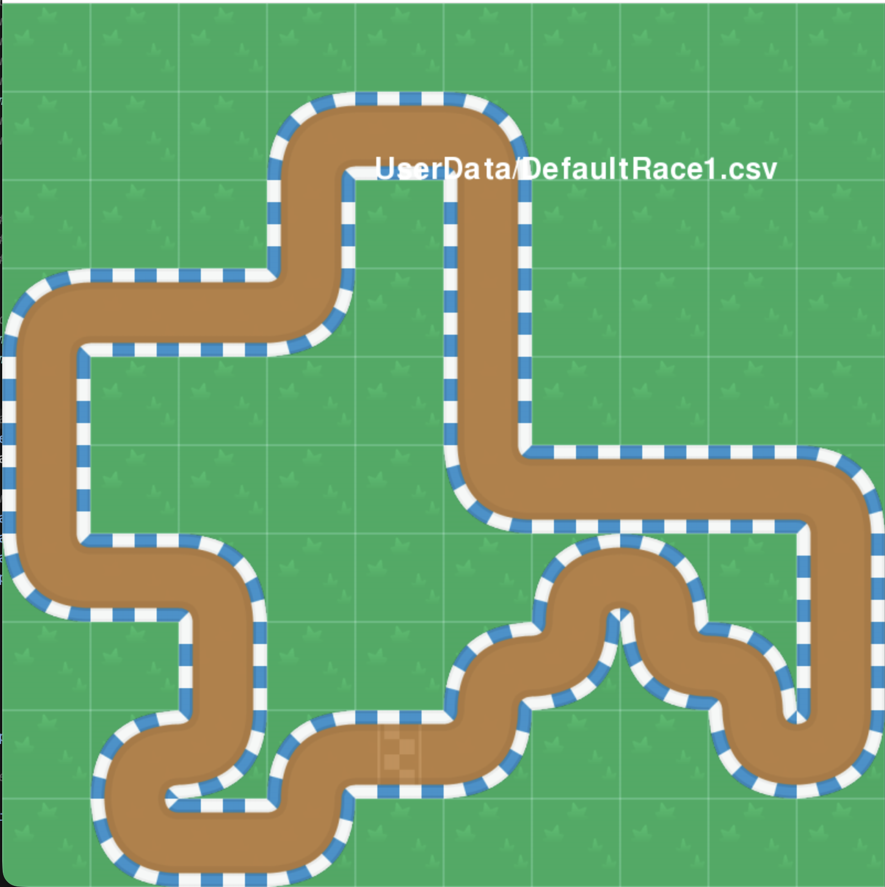
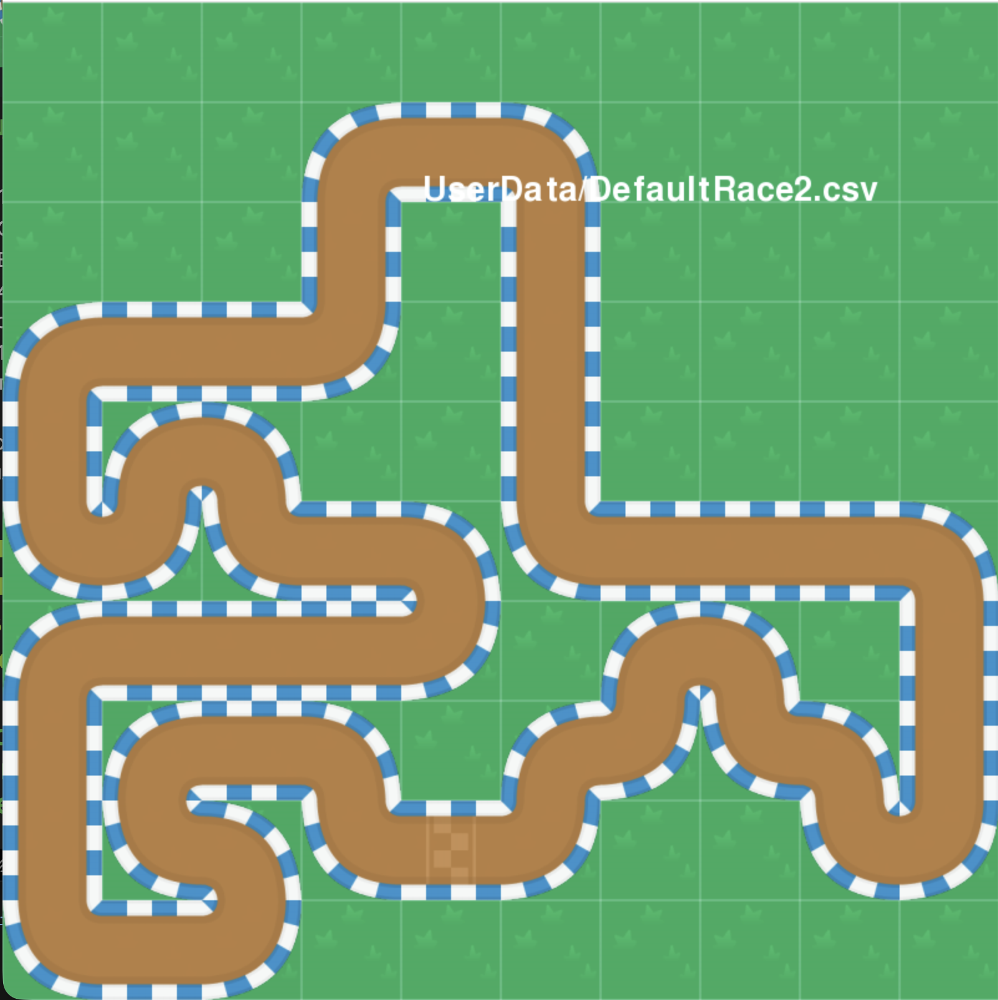
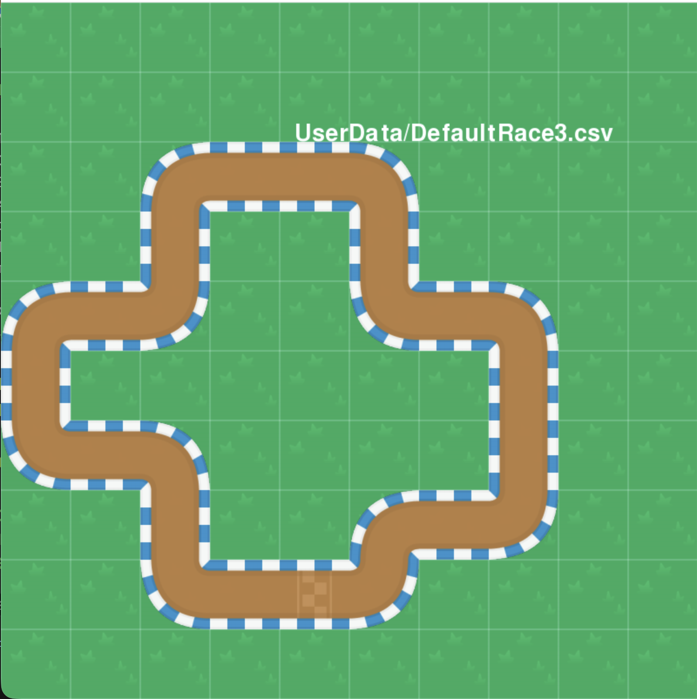

# Prezentace: Učení AI-modelů pro řízení autíček na trati

## Tým Zero

  

---

  

## Slide 1. Úvod

- Cíl: naučit agenty projíždět trať podle 9 ray-senzorů (paprsků) a rychlosti.

- Ovládání: 4 akce `[plyn, brzda, vlevo, vpravo]`.

  

---

  

## Slide 2. Prostředí a data

- Pozorování: `len(data)=9` paprsků + `speed_norm`.

- Akce: hodnoty 0..1, dále engine používá práh `> 0.5`.

- Hlavní problém: agenti se často „sami zničí“ (nabourají do zdi), pokud nemají správnou bezpečnostní logiku.

  

---

  

## Slide 3. Model č. 1 — Behavior Tree (neefektivní)

Soubor: `AI_engines/AIbrain_BehaviorTree.py`

- Výhody: zcela interpretovatelné, snadné ladění prahů.

- Nevýhody (proč to nebylo efektivní):

- Vyžaduje ruční nastavení mnoha prahů podle konkrétní trati/fyziky.

- Špatně se přenáší mezi různými mapami: stačí malé změny a logika začíná chybovat.

- Narazí na „strop kvality“: strom je těžké udělat dostatečně flexibilní jako učený model.

  

---

  

## Slide 4. Model č. 2 — Q-learning (problémy se zápisem/pamětí)

Soubor: `AI_engines/AIbrain_QLearning.py`

- Myšlenka: ukládat Q-tabulu a zkušenost, učit se online.

- Hlavní bolest:

- Soubor se savem (`.npz`) **velmi rychle narůstal** kvůli velkému množství unikátních stavů/zkoušeností.

- Vznikaly **problémy s pamětí** a výkonem při ukládání/načítání.

- Při velkém objemu dat byla nižší spolehlivost při načítání (poškozené/neúplné soubory).

  

---

  

## Slide 5. Model č. 3 — Neuronová síť (funguje): obyčejný MLP

Soubor: `AI_engines/AIbrain_Zero.py`

- **Vstup**: `len(data) + 1 = 9 ray‑senzorů + 1 speed_norm` → **10 vstupů**

- **Hidden1**: `hidden_size = 24`, aktivace **ReLU**

- **Hidden2**: `hidden_size2 = 16`, aktivace **ReLU**

- **Výstup**: `output_size = 4`, aktivace **Sigmoid** → `[plyn, brzda, vlevo, vpravo]`

  

---

  

## Slide 6. Forward‑pass MLP (z kódu)

Vzorce:

- \(z_1 = inputs @ w1 + b1,\quad a_1 = ReLU(z_1)\)

- \(z_2 = a_1 @ w2 + b2,\quad a_2 = ReLU(z_2)\)

- \(z_3 = a_2 @ w3 + b3,\quad a_3 = sigmoid(clip(z_3))\)

  

Poté `decide()`:

- převádí výstupy na „tlačítka“ přes práh **`> 0.5`**

- zajišťuje, že **vlevo/vpravo** a **plyn/brzda** nejsou aktivní zároveň

  

---

  

## Slide 7. Proč byl MLP úspěšný

- Model lépe zobecňuje na spojitých senzorech (paprscích) než tabulky.

- Velikost parametrů je fixní → ukládání zůstává malé, bez „exploze“ velikosti jako u Q-learningu.

- Dobře se kombinuje s generačním učením (mutace/výběr) a jde dále trénovat pomocí gradientů.

  

---

  

## Slide 8. Mapy, na kterých probíhal trénink

Sada tratí:

- `Map1.png`

- `Map2.png`

- `Map3.png`

  

Vizuálně:

  

---

  

## Slide 9. Shrnutí

- Behavior Tree: rychlý prototyp, ale málo učenlivý a špatná přenositelnost.

- Q-learning: zajímavý baseline, ale narazil na růst dat a potíže se zápisem/pamětí.

- MLP: nejlepší rovnováha kvality a stability, snadno se rozšiřuje a trénuje.

![[finish.png]]

  

---

  

## Slide 10. Další kroky

- Zlepšit stabilitu chování (držet střed, anti-úhel, safety omezení).

- Učit na více mapách a ověřit přenositelnost.

- Experimentovat s rewardem/strategií učení (evoluce + backprop).